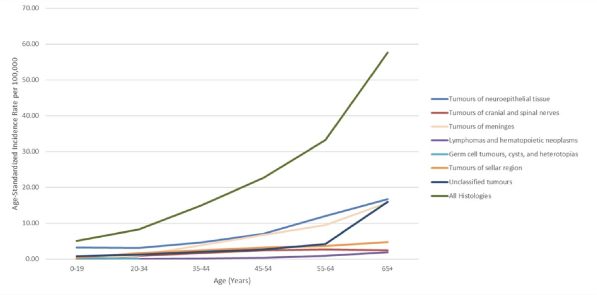
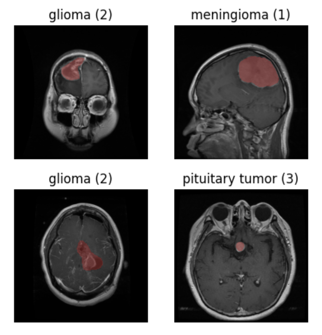
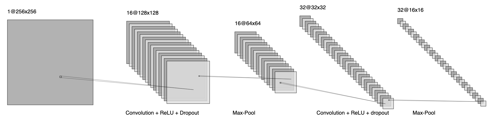
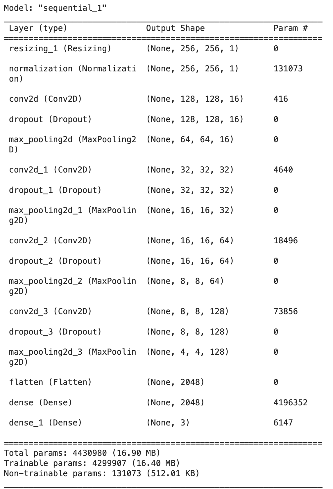
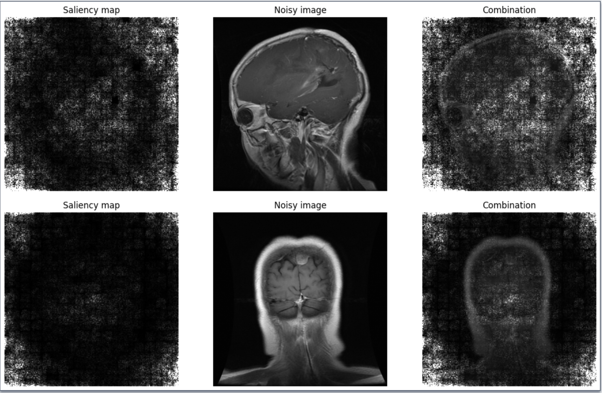
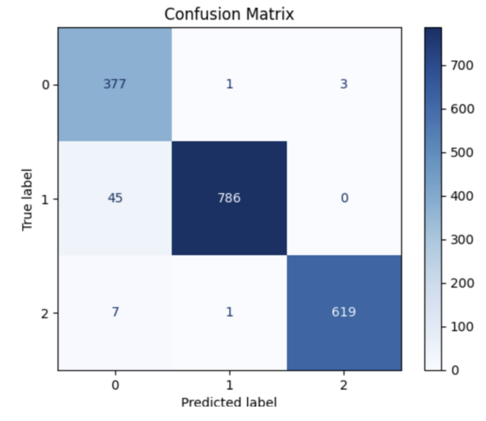

# Capstone Project Documentation 

Authors: Laura Madrid, Lucas Noritomi-Hartwig, Keshav Worathur

Project Repository: https://github.com/kworathur/CV-Capstone/tree/main

December 5, 2023

# Problem 
Brain tumours affect approximately 50,000 Canadians
every year, according to the Brain Tumour Registry of Canada (BTRC) [1]. Manual diagnosis
of brain tumours is time-intensive and requires specialized knowledge of the brain [2]. We seek to develop automatic methods for diagnosis of glioma, meningioma, and pituitary tumors from Magnetic Resonance
Imaging (MRI) scans. This entails a multi-class classification problem for which we hope to develop novel approaches.



# Dataset 
Our chosen dataset is the figshare brain tumour dataset [3]. This dataset is available on [kaggle](https://www.kaggle.com/datasets/ashkhagan/figshare-brain-tumor-dataset/). The dataset contains 3,064 slices of MRI scans from patients at Nanfang Hospital, Guangzhou, China. The slices were taken in the sagittal, axial, and coronal planes. 

Examples of the tumour scans are shown below:




The input to the model is a MRI slice resized to $256 \times 256$ pixels. The labels are 1 for Meningioma, 2 for Glioma, and 3 for Pituitary.

The dataset notably includes patient IDs, which we will use during evaluation of the model to prevent the model from being evaluated on patients on which it was trained. This is important to ensure that a model cannot use patient-specific markers in a scan as a "shortcut" for making predictions.
# Implementation Details 

We implemented a custom Convolutional Neural Network (CNN) in Tensorflow. The architecture is detailed in the paper "Classification of Brain Tumors using a Convolutional Neural Network"[3]


## Loading the Data 

To load in the dataset, we created a custom pre-processing pipeline:

1. Resize the image from $512 \times 512$ pixels to $256 \times 256$ pixels. 
2. Augment the image by performing a $90^\circ$ rotation or be performing a flip over the horizontal axis. 
3. Standardizing the pixels values in the input image. 

We load the images into memory in batches of 16, to avoid exceeding the RAM quota in Google Colab. 

## Model Implementation  

Our model consists of four classification blocks, arranged in a sequence to downsample the input image into a summary vector of size $2048$. A diagram containing two such classification blocks is shown below:




The model outputs a **softmax** vector of probabilities, where each probabilitity represents the likelihood that a tumor class is present in the MRI scan. We take the class corresponding to the largest probability as the model's prediction.



As we can see, the model has a much smaller capacity than models such as VGG16, which has 138 million parameters. The small size of our model makes it possible to be deployed on a mobile phone or other inexpensive hardware. 

## Problems we could not solve

When we planned our project, we aimed to explain the decisions of our model by generating  **counterfactual** images. Counterfactual images help us answer questions such as:

> How would this scan of a patient with a Meningioma tumor be different if the patient instead had a Glioma tumor according to the model?

Asking such questions help us as humans understand what features in the scan cause the model to choose one class over another. This in turn allows us to gain more insight into the model's decision making process. 

To implement this idea, we considered using Generative Adversarial Networks (GANs), for generating such counterfactual images. However, the complexity that lies in training a GAN from scratch persuaded us to consider alternative approaches.

## Novel Contribution

When a model and a neurologist differ in their opinions about a scan, how can we reconcile these differences? Our novel contribution is the use of saliency maps for interpreting our classifier's decisions. Our saliency maps are computed by taking partial derivates of the predicted class with respect to each pixel of the original image.

\pagebreak 



Lighter pixels correspond to regions of the image where the model is more sensitive to the input. We expect lighter pixels to be conentrated near the tumour if the model was most heavily influenced by the shape and location of the tumour. However, this is not the case, as we can see that the model is also highly sensitive to the background of the image. One explanation for this result is that the pixels in the background are fairly stable from image to image, so the model can afford to be heavily dependent on these pixels without sacrificing classification its accuracy.


\pagebreak


# Evaluation Results 

We trained our model using the NVIDIA T4 GPU available in Colab. We stopped training if the validation accuracy did not improve for 11 consecutive epochs. 

The first approach used for evaluating the model is called "one test". We simply use a 60-20-20 split for the training, validation, and test sets respectively. When evaluating our model on a single test set, we obtained a test accuracy of $93.4\%$. This is a promising result, however we wanted to be more confident in our assessment of the model's performance so we employed another evaluation technique called **10-fold subject-wise cross validation**. 


The procedure for evaluating the model using subject-wise cross validation is as follows:

* Split the dataset into 10 subsets, called **folds**, where each patient can appear in only one fold. The number of distinct patients in each  fold is roughly equal.
* Set aside two folds for the test set, two folds for the validation set, and using the remaining six folds as the training dataset.
* Train the model and record the test accuracy.
* Repeat this process until every example has appeared in the test set. Average the test accuracies to produce an estimate of the model's performance on unseen data.

We obtained an average test accuracy of $91.3\%$. This shows the model can differentiate between the different tumor classes. However, there is strong evidence the model may misclassify tumors when deployed in the real world. 


The figure below visualizes the performance of the model on the test set using a
confusion matrix. The confusion matrix allows us to easily determine if two
classes are being confused by the model. Label 0 corresponds to meningioma
tumors, label 1 corresponds to glioma tumors, and label 2 corresponds to
pituitary tumors. The values along the diagonal correspond to true positive count
for each of the classes.




An area of concern is the second row, which shows that 45 of the true Glioma
tumors were incorrectly classified as Meningioma tumors. This means that out of
the three tumor classes, Glioma has the lowest specificity or true positive rate.


# Individual Contributions 

Throughout the semester, we worked as a group to develop our project and address issues as they arised. All members contributed equally to the project, with individual contributions listed below:


Laura Madrid explored novel extensions to our project, such as GANs for producing counterfactual images and the vanilla gradient method of producing saliency maps.

Lucas Noritomi-Hartwig selected the dataset and performed data pre-processing. He also researched novel extensions to our project and wrote the code for saliency maps.

Keshav Worathur researched related works pertaining to our problem and set up the project repository. He wrote code for the data pre-processing pipeline and trained the model.


# References
[1]Brain Tumour Registry of Canada. https://braintumourregistry.ca/, 2019. Accessed: 2023-10-01. 

[2] E. S. Biratu, F. Schwenker, Y. M. Ayano, and T. G. Debelee, “A survey of brain tumor seg-
mentation and classification algorithms,” J Imaging, vol. 7, Sept. 2021.

[3] Milica M Badža and Marko Č Barjaktarović.
Classification of brain tumors from mri images using a convolutional neural network.
Applied Sciences, 10(6):1999, 2020.

# Workflow

The notebook `brain_tumor_classifcation.ipynb` contains code for:

* Downloading the dataset from Kaggle.
* Extracting images from .mat files, saving them to .png files.
* Visualizing MRI slices with tumour annotations.
* Pre-processing the data and augmenting the dataset.
* Training the model, saving model checkpoints to `best_model.h5`.
* Producing saliency maps from the trained model, with the option to load a pre-trained model.


To open the notebook in Google Colab:

1. File > Open Notebook 
2. Open Notebook > From GitHub
3. Paste the repository url (https://github.com/kworathur/CV-Capstone/tree/main) in the search bar and click `brain_tumor_classification.ipynb` to open the notebook.
4. Runtime > Change Runtime Type > T4 GPU
5. Runtime > Run All
6. The second cell contains the following code: 

    ```
    from google.colab import files
    files.upload() # Upload your kaggle API Key
    ```

    This waits until the user uploads their kaggle API key, named kaggle.json. The notebook runs without user input, first visualizing the data then training the model. The saved model is saved to best_model.h5

7. If you would only like to view the saliency maps, locate the section titles "Load the Best Model", and upload the pretrained model `best_model.h5` (found in this repository). Then, run the remaining cells to view the saliency maps. 
