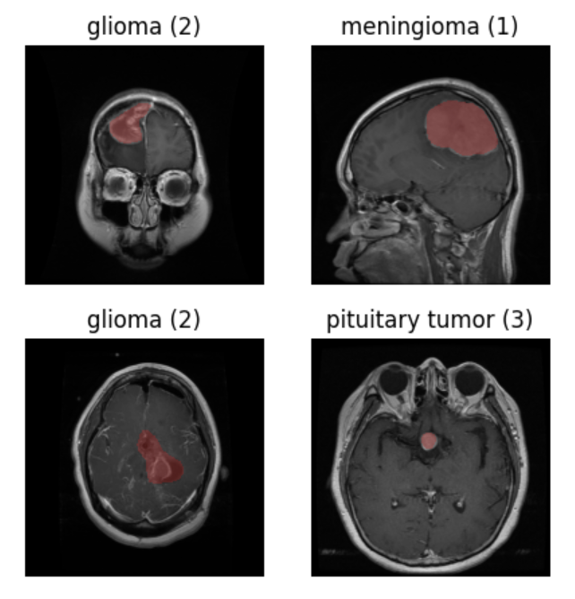
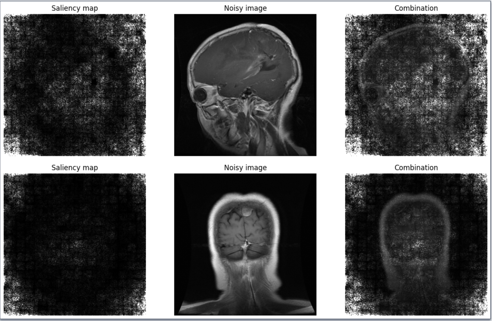

# Capstone Project Documentation 

Authors: 
# Problem 
Brain tumours affect approximately 50,000 Canadians
every year, according to the Brain Tumour Registry of Canada (BTRC) [1]. Manual diagnosis
of brain tumours is time-intensive and requires specialized knowledge of the brain [2]. We seek to develop automatic methods for diagnosis of glioma, meningioma, and pituitary tumors from Magnetic Resonance
Imaging (MRI) scans. This entails a multi-class classification problem to which we hope to apply
machine learning techniques in new and insightful ways.

# Dataset 
Our chosen dataset is the figshare brain tumour dataset [3]. This dataset is available at [kaggle](https://www.kaggle.com/datasets/ashkhagan/figshare-brain-tumor-dataset/). The dataset contains 3,064 slices of MRI scans from patients at Nanfang Hospital, Guangzhou, China. The slices were taken in the sagittal, axial, and coronal planes. 

Examples of the tumour scans are shown below:

The input to the model is a MRI slice resized to $256 \times 256$ pixels. The labels are 1 for Meningioma, 2 for Glioma, and 3 for Pituitary.

# Implementation Details 

We implemented a custom Convolutional Neural Network (CNN) in tensorflow. 

## Loading the Data 

To load in the dataset, we created a custom pre-processing pipeline:

1. Resize the image from $512 \times 512$ pixels to $256 \times 256$ pixels. 
2. Augment the image by performing a $90^\circ$ rotation or be performing a flip over the horizontal axis. 
3. Standardizing the pixels values in the input image. 

We load the images into memory in batches of 16, to avoid exceeding RAM quota in Google Colab. We trained our model using the NVIDIA T4 GPU available in Colab.

## Model Implementation  

Our model consists of four classification blocks, arranged in a sequence to downsample the input image into a summary vector of size $2048$. A diagram of a single classification block is shown below:

The model outputs a **vector of probabilities**, where each probabilitity represents the likelihood that a tumor class is present in the MRI scan. We take the class corresponding to the largest probability as the model's prediction.

## Novel Contributions 

Our novel contribution is the use of saliency maps for interpreting our classifier's decisions.Our saliency maps are computed by taking partial derivates of the predicted class with respect to each pixel of the original image.

# Evaluation Results 

Our model achieved a final test accuracy of $95.56\%$. When we averaged the test accuracies of five of our models trained on different data, we obtained a final test accuracy of $93.4\%$. 

# Invidual Contributions 

Laura Madrid explored novel extensions to our project, such as GANs for producing counterfactual images and the vanilla gradient method of producing saliency maps.

Lucas Noritomi-Hartwig selected the dataset and performed data pre-processing. He also researched novel extensions to our project and wrote the code for saliency maps.

Keshav Worathur researched related works pertaining to our problem and set up the project repository. He wrote code for the data pre-processing pipeline and trained the model.

# References
[1]Brain Tumour Registry of Canada. https://braintumourregistry.ca/, 2019. Accessed: 2023-10-01. 

[2] E. S. Biratu, F. Schwenker, Y. M. Ayano, and T. G. Debelee, “A survey of brain tumor seg-
mentation and classification algorithms,” J Imaging, vol. 7, Sept. 2021.
